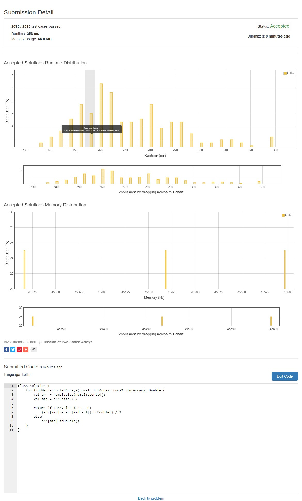

## 문제
There are two sorted arrays nums1 and nums2 of size m and n respectively.  
Find the median of the two sorted arrays. The overall run time complexity should be O(log (m+n)).  
You may assume nums1 and nums2 cannot be both empty.  

**Example 1**:
  ```
  nums1 = [1, 3]
  nums2 = [2]

  The median is 2.0
  ```
**Example 2:**
  ```
  nums1 = [1, 2]
  nums2 = [3, 4]

  The median is (2 + 3)/2 = 2.5
  ```

---
## 결과


---
## 해석
### 시간 복잡도
입력값 N에 대하여 알고리즘이 문제를 해결하는 데 얼마나 오랜 시간이 걸리는 지 분석하는 것
* O(1) : 알고리즘의 단계가 1단계
* O(log n) : 특정 단계마다 시간이 단축
* O(n) : 입력값과 동일한 시간
* O(n^2) : 입력값의 제곱
* O(2^n) : 입력값만큼의 제곱

O(1)부터 O(2^n)순으로 알고리즘 속도가 느려진다.  
결국 문제는 `O(log n)`의 속도를 요구한다.

### 중위값
중앙값이라고도 하며 자료(사료 혹은 변량)가 순서대로 정렬돼 있을 시 가운데 값이다.
  * 자료의 개수가 `짝수` - n/2, (n/2 + 1)
  * 자료의 개수가 `홀수` - (n + 1)/2
  
문제처럼 입력값이 [1, 2], [3, 4]일 경우 짝수개이므로
  * 4/2 = 2번재 인덱스
  * 4/2 - 1 = 1번째 인덱스 (인덱스가 0부터 시작하므로)
  
로 평균값을 구하면 `(2 + 3) / 2 = 2.5`가 나오게 된다.

### 소스
```kotlin
val arr = num1.plus(num2).sorted()
```
코틀린에서 배열의 `plus`는 인자로 받는 값을 리시버에 더해주는 역할을 하며 `sorted`는 정렬된 배열을 리턴한다.  
`sort`의 경우 해당 배열 자체를 정렬하는 함수이므로 헷갈리지 않도록 한다.
