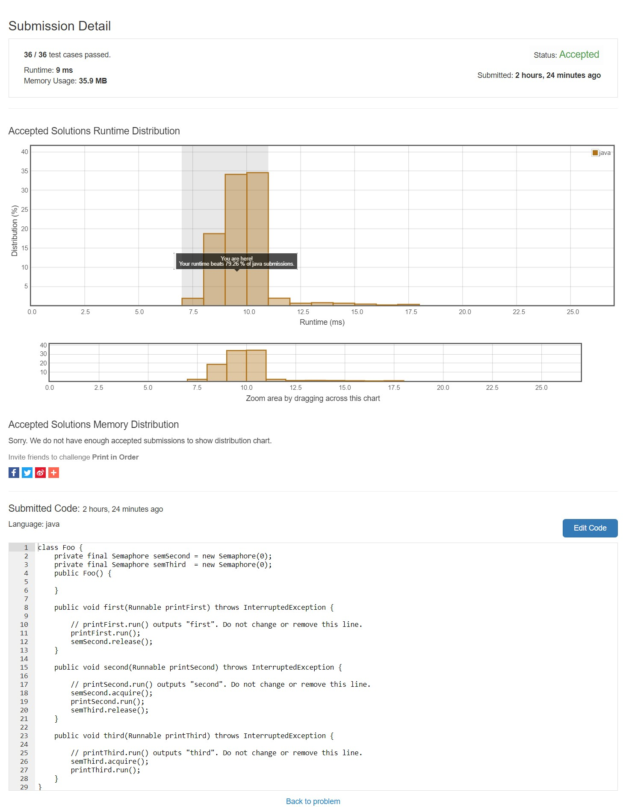

## 문제
Suppose we have a class:
```
public class Foo {
  public void first() { print("first"); }
  public void second() { print("second"); }
  public void third() { print("third"); }
}
```
The same instance of `Foo` will be passed to three different threads. Thread A will call `first()`, thread B will call `second()`, and thread C will call `third()`. Design a mechanism and modify the program to ensure that `second()` is executed after `first()`, and `third()` is executed after second().

**Example 1**:
  ```
  Input: [1,2,3]
  Output: "firstsecondthird"
  Explanation: There are three threads being fired asynchronously. The input [1,2,3] means thread A calls first(), thread B calls second(), and thread C calls third(). "firstsecondthird" is the correct output.
  ```
**Example 2**:
  ```
  Input: [1,3,2]
  Output: "firstsecondthird"
  Explanation: The input [1,3,2] means thread A calls first(), thread B calls third(), and thread C calls second(). "firstsecondthird" is the correct output.
  ```

Note:

We do not know how the threads will be scheduled in the operating system, even though the numbers in the input seems to imply the ordering. The input format you see is mainly to ensure our tests' comprehensiveness.

---
## 결과


---
## 해석
### 동기화
동기화를 위한 아이템은 여러가지가 있는데 그 중 제일 많이 사용되고 유명한 것이 `세마포어`와 `뮤텍스`이다.
* 세마포어
  * 스레드 간 동기화를 담당
  * 여러개의 스레드가 참여할 수 있음
* 뮤텍스
  * 프로세스 간 동기화를 담당
  * 단 한개의 프로세스만 참여 가능

### 소스
```java
sem.acquire();
sem.release();
```
세마포어의 `acquire()`는 리소스를 점유하기 위한 함수로 만약 누군가가 이미 리소스를 점유하고 있을 시 대기를 하게 된다.  
세마포어의 `release()`는 점유하고 있던 리소르를 해지하는 함수로 `acquire()`이후 꼭 호출해야 하며 만약 호출하지 않을 시 `DeadLock`이 발생한다.
